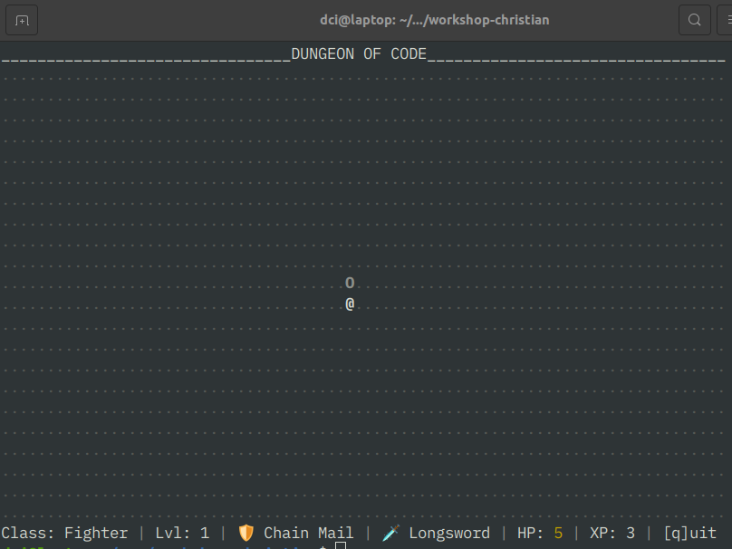

# Terminal RPG

## Steuerung (WASD)

-  w - hoch
-  a - links
-  s - runter
-  d - rechts
-  i - inventar
-  q - quit

## Benutze Pakete

-  readline-sync (https://www.npmjs.com/package/readline-sync)
-  chalk (https://www.npmjs.com/package/chalk)

## ToDo

-  Inventar-Screen ausbauen
-  Attacken mit SpielerIn / Monstern verbinden
-  mehrere Monster
-  zufällig im Dungeon verteilte Schriftrollen -> Zauber (neue Attacke)
-  Fallen
-  Loot!
